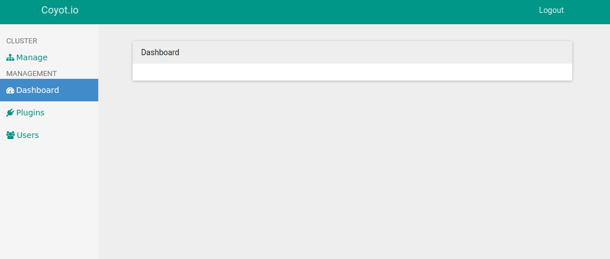

# coyot.io

The scalable, cluster-ready server management panel.

### The "What"

What is coyot.io you ask?  Every system admin's dream:  a control panel built for flexibility and scaling, leveraging the power of a MEAN stack and the elegance of Material Design.

### The "Why"

When I first started servers, I found that the best way to manage the system was to SSH in and do everything by hand.  Few control panels offered the flexibility and automation to make a difference for system admins and IT teams.

A couple years later, we still haven't evolved much in the way of control panels.  Services such as AWS OpWorks and Bitnami offer quick, flexible management, but at a cost and with limits.  Panels like Ajenti get closer to achieving what we need, but still fall short.

### The "Who"

If you really care to know who is crazy enough to start this, the name is Keyton Stanier, a 17 y/o with a passion for the evolving digital world.

## Installation

Simply do `npm install coyot.io` and you're ready to go!

## Usage

TODO: Write usage instructions

## Contributing

Want to contribute?  Great!  Open an issue for a bug or feature you wish to work on or start working on anything on the roadmap.

I appreciate any and all valid contributions, both in the form of code and feedback.

1. Fork it!
2. Create your feature branch: `git checkout -b my-new-feature`
3. Commit your changes: `git commit -am 'Add some feature'`
4. Push to the branch: `git push origin my-new-feature`
5. Submit a pull request :D

## License

Licensed under MIT License.  Please see [LICENSE](LICENSE)
